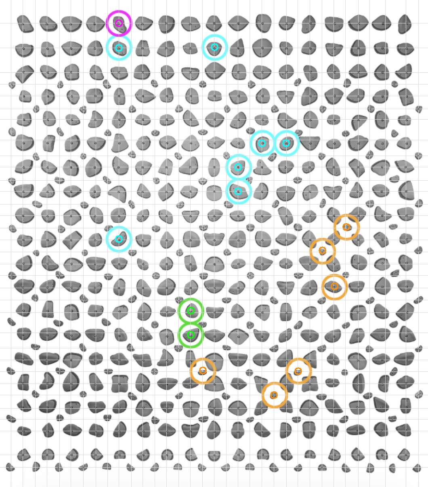
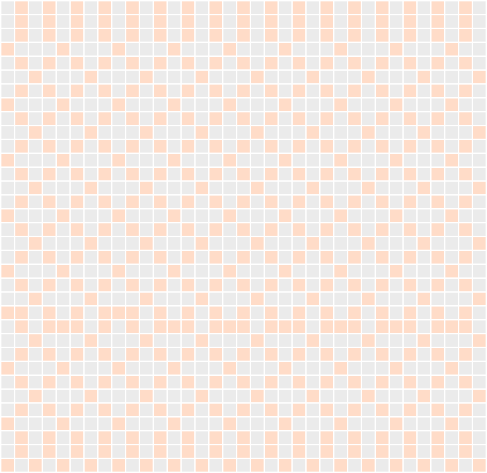
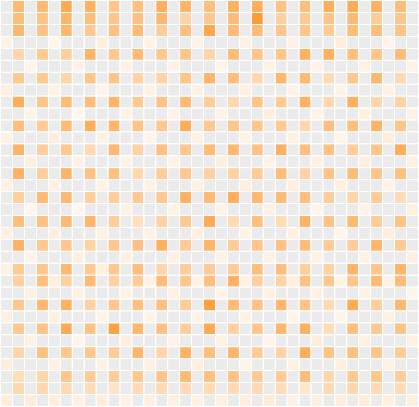
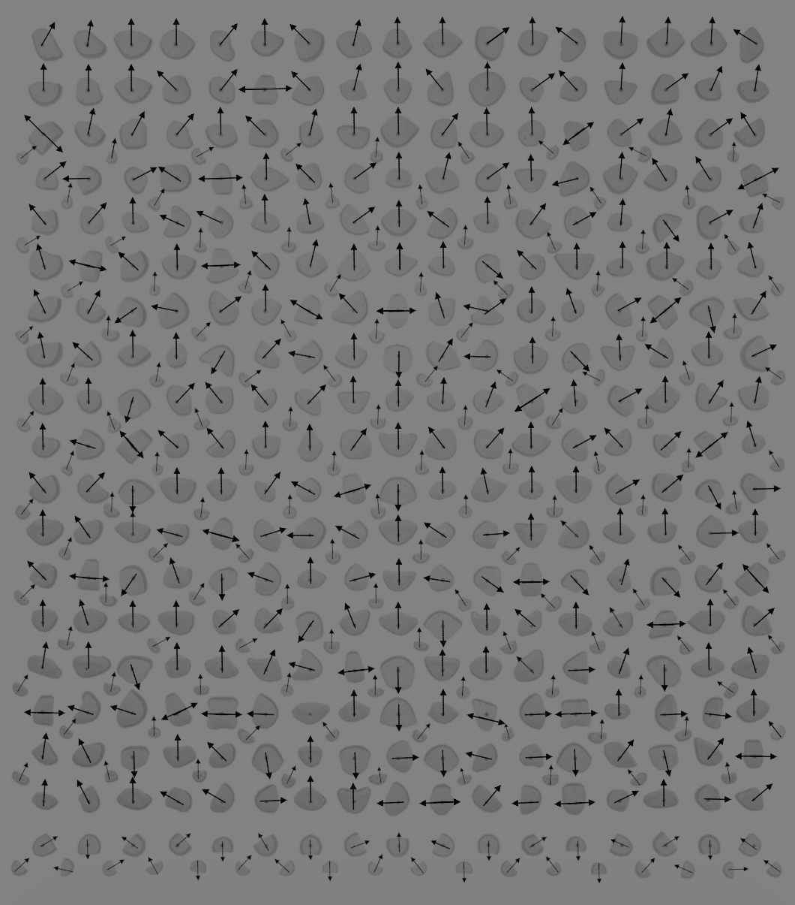
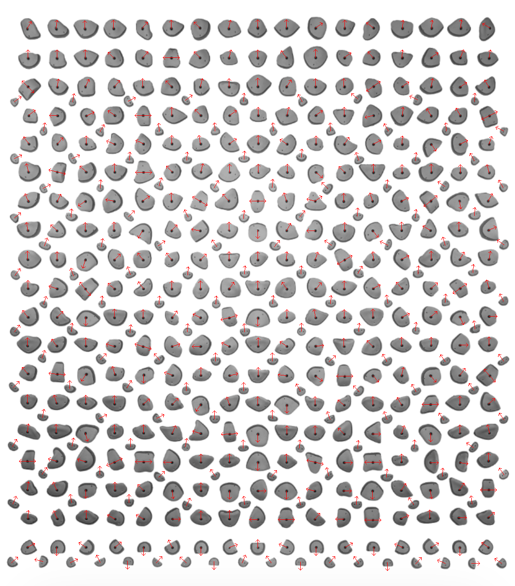

# Kilterboard Dataset

This dataset represents Kilterboard routes as fixed-size matrices derived from a detected hold grid and ring labels.

## Matrix Dimensions

Each route is encoded as a tensor with shape `rows x cols x channels`.

- `rows`: 34
- `cols`: 35
- `channels`: 10

## Channel Labels

Channel order (axis 2) is:

- `start` (binary)
- `finish` (binary)
- `hand` (binary)
- `foot` (binary)
- `hold_presence` (binary, 1 if a hold exists at that grid cell)
- `hold_size` (float in [0, 1], normalized hold area)
- `orient_sin1` (float, `sin(theta1)` for primary orientation)
- `orient_cos1` (float, `cos(theta1)` for primary orientation)
- `orient_sin2` (float, `sin(theta2)` for secondary orientation)
- `orient_cos2` (float, `cos(theta2)` for secondary orientation)

Orientation angles are stored per hold in `ImageData/References/holds.json` and are also encoded per grid cell as `sin/cos` channels. The exported matrices are `34 x 35 x 10` with the channel list above.

## Overlay (Hold Grid + Labeled Rings)

The overlay shows the detected hold centers and grid lines, with colored rings indicating labeled holds.

Legend:
- Green ring: `start`
- Magenta ring: `finish`
- Cyan ring: `hand`
- Orange ring: `foot`
- Gray dots: detected hold centers
- Light grid: row/column centers used for the matrix layout

## Hold Grid Maps

The following images visualize the per-cell maps used for the static channels.

### Hold Presence (Binary)

Legend:
- Light orange: hold present (1)
- Light gray: no hold (0)

### Hold Size (Normalized)

Legend:
- Light gray: no hold
- Light orange: smaller holds
- Darker orange: larger holds

## Hold Orientations

Each hold can have up to two orientation angles (in radians) stored in `ImageData/References/holds.json` under `holds[*].orientations`. Angles are measured using `atan2(dy, dx)` in image coordinates, so values are in `[-pi, pi]` relative to the +x axis. These are encoded into the matrix as `orient_sin1/cos1` and `orient_sin2/cos2`.

### Orientation Input (Annotated Board)

### Orientation Overall Bias Check

Legend:
- Red arrows: detected hold orientation vectors (up to two per hold)

## Notes

- The grid is derived from the detected hold centers stored in `ImageData/References/holds.json`.
- `hold_size` is normalized by the maximum hold area in the board so values are in `[0, 1]`.
- The sample metadata in `ImageData/50Degree/ExportPreview/*.json` reflects the same `rows`, `cols`, and `channels` used for export.
- Dataset for now consists only of 50° climbs, which are established and 6a/V3 or higher

## Grade Distribution Statistics

Source: `ImageData/grade_distribution_45_50.csv`

Format: `V grade/French grade` (example: `V3/6a`).

Total routes: **45° = 32813**, **50° = 30000**

| Grade | 45° Count | 45° Percent | 50° Count | 50° Percent |
|---|---:|---:|---:|---:|
| V3/6a | 4655 | 14.19% | 3210 | 10.7% |
| V4/6b | 4654 | 14.18% | 3570 | 11.9% |
| V5/6c | 5314 | 16.19% | 3870 | 12.9% |
| V6/7a | 4883 | 14.88% | 3840 | 12.8% |
| V7/7a+ | 3676 | 11.2% | 2970 | 9.9% |
| V8/7b | 4396 | 13.4% | 4890 | 16.3% |
| V9/7c | 2403 | 7.32% | 3000 | 10.0% |
| V10/7c+ | 1547 | 4.71% | 2160 | 7.2% |
| V11/8a | 627 | 1.91% | 1470 | 4.9% |
| V12/8a+ | 99 | 0.3% | 690 | 2.3% |
| V13/8b | 0 | 0% | 90 | 0.3% |
| Unknown | 559 | 1.7% | 240 | 0.8% |
