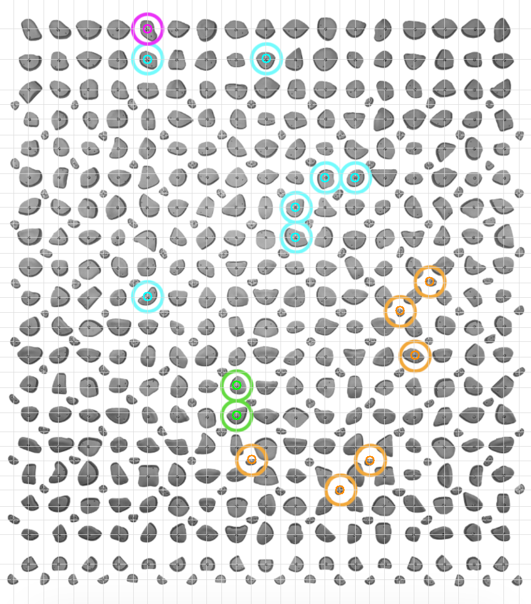
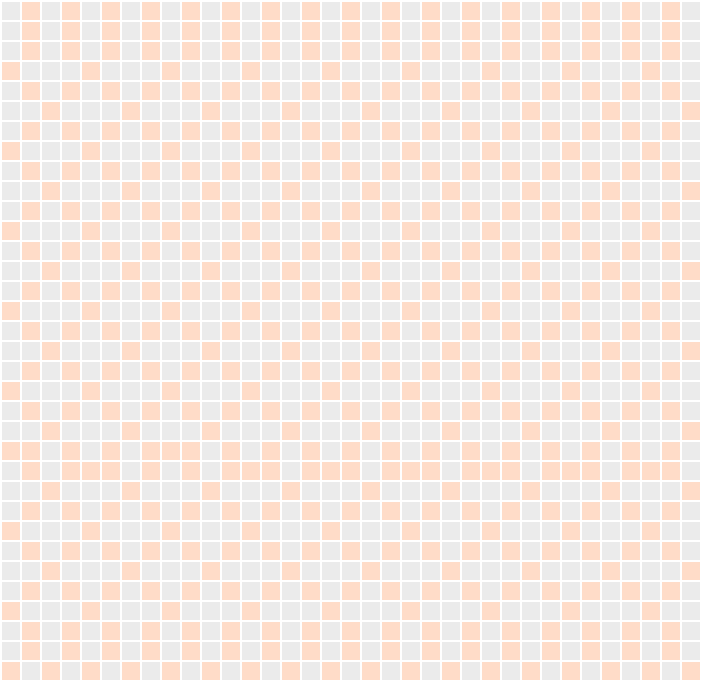
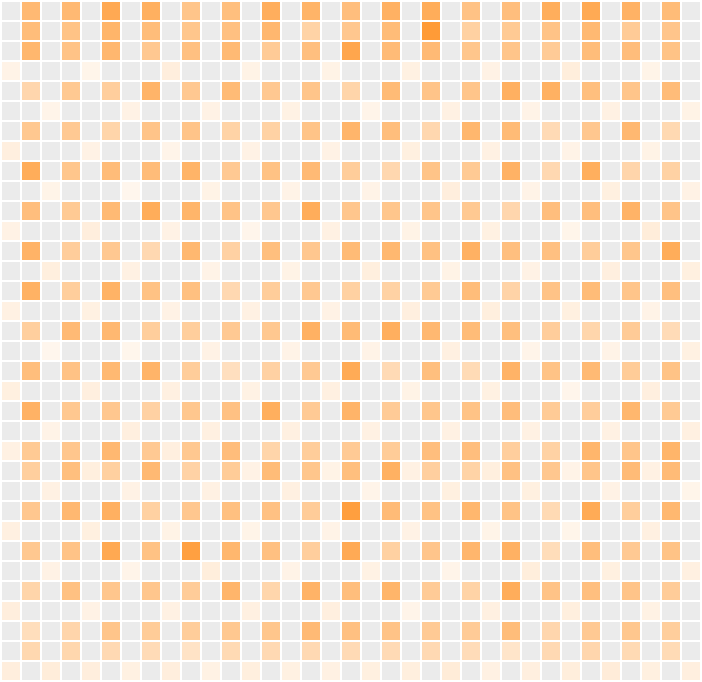
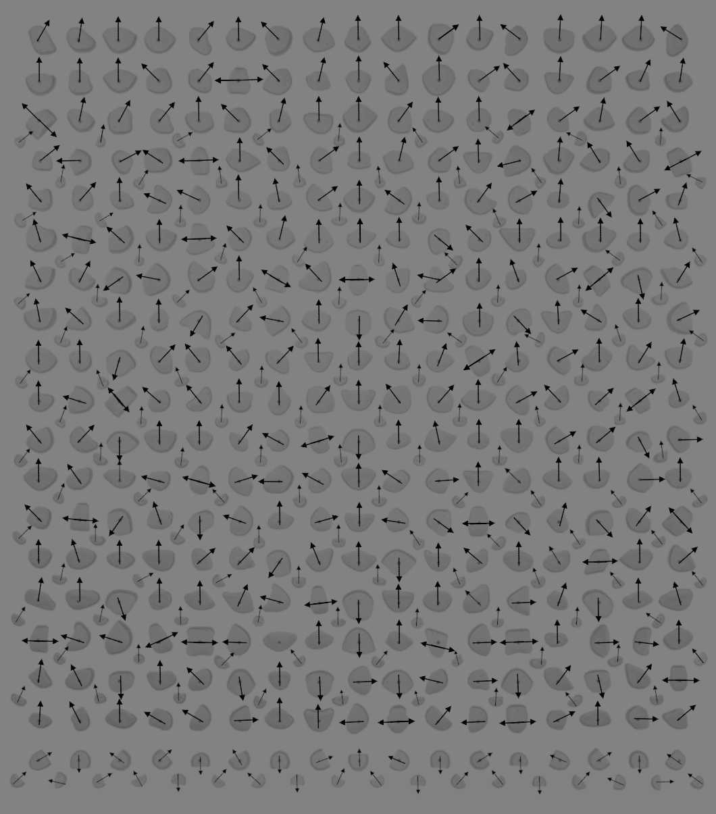
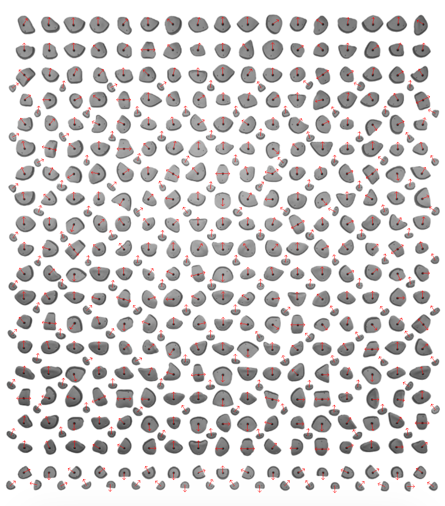

# Kilterboard Dataset

This dataset represents Kilterboard routes as fixed-size matrices derived from a detected hold grid, ring labels, and per-hold orientation annotations.

## Matrix Dimensions

Each route is encoded as a tensor with shape `rows x cols x channels`.

- `rows`: 34
- `cols`: 35
- `channels`: 10

## Channel Labels

Channel order (axis 2) is:

- `start` (binary)
- `finish` (binary)
- `hand` (binary)
- `foot` (binary)
- `hold_presence` (binary, 1 if a hold exists at that grid cell)
- `hold_size` (float in [0, 1], normalized hold area)
- `orient_sin1` (float, `sin(theta1)` for primary orientation)
- `orient_cos1` (float, `cos(theta1)` for primary orientation)
- `orient_sin2` (float, `sin(theta2)` for secondary orientation)
- `orient_cos2` (float, `cos(theta2)` for secondary orientation)

Orientation angles are stored per hold in `ImageData/References/holds.json` and are also encoded per grid cell as `sin/cos` channels. The exported matrices are `34 x 35 x 10` with the channel list above.

## Route vs Static Channels

The first 4 channels are dynamic route labels:

- `start`
- `finish`
- `hand`
- `foot`

The remaining 6 channels are static board context shared by all climbs on the same board setup:

- `hold_presence`
- `hold_size`
- `orient_sin1`
- `orient_cos1`
- `orient_sin2`
- `orient_cos2`

## Overlay (Hold Grid + Labeled Rings)

The overlay shows the detected hold centers and grid lines, with colored rings indicating labeled holds.



Legend:
- Green ring: `start`
- Magenta ring: `finish`
- Cyan ring: `hand`
- Orange ring: `foot`
- Gray dots: detected hold centers
- Light grid: row/column centers used for the matrix layout

## Hold Grid Maps

The following images visualize the per-cell maps used for the static channels.

### Hold Presence (Binary)



Legend:
- Light orange: hold present (1)
- Light gray: no hold (0)

### Hold Size (Normalized)



Legend:
- Light gray: no hold
- Light orange: smaller holds
- Darker orange: larger holds

## Hold Orientations

Each hold can have up to two orientation angles (in radians) stored in `ImageData/References/holds.json` under `holds[*].orientations`. Angles are measured using `atan2(dy, dx)` in image coordinates, so values are in `[-pi, pi]` relative to the +x axis. These are encoded into the matrix as `orient_sin1/cos1` and `orient_sin2/cos2`.

### Orientation Input (Annotated Board)



### Orientation Overall Bias Check



Legend:
- Red arrows: detected hold orientation vectors (up to two per hold)

## Notes

- The grid is derived from the detected hold centers stored in `ImageData/References/holds.json`.
- `hold_size` is normalized by the maximum hold area in the board so values are in `[0, 1]`.
- The canonical dataset lives in `ImageData/50Degree/ExportClean/` as 1,000 paired `.npy` and `.json` files.
- The 30,000 source screenshots contain 30 captures of the same 1,000 route slots; they are not 30,000 independent training examples.
- Colored rings are classified at calibrated hold centers using a 25-35 pixel annulus. Argmax role assignment prevents one hold from appearing in multiple route channels.
- `ImageData/50Degree/ExportClean/dataset_audit.json` records route-count constraints, grade counts, role-count histograms, and unique matrix counts.
- Dataset for now consists only of 50° climbs, which are established and `6a / V3` or higher.

## Model Usage

Current training scripts use this split:

- CVAE and diffusion models predict only the 4 dynamic route channels.
- Both models consume all 6 static channels as conditioning context.

## Grade Distribution Statistics

Historical source screenshot distribution (including repeated captures).

Format: `V grade/French grade` (example: `V3/6a`).

Source screenshot files: **45° = 32813**, **50° = 30000**. The 50° counts below include the 30 repeated capture passes; the cleaned training set contains 1,000 canonical routes with the same percentages.

| Grade | 45° Count | 45° Percent | 50° Count | 50° Percent |
|---|---:|---:|---:|---:|
| V3/6a | 4655 | 14.19% | 3210 | 10.7% |
| V4/6b | 4654 | 14.18% | 3570 | 11.9% |
| V5/6c | 5314 | 16.19% | 3870 | 12.9% |
| V6/7a | 4883 | 14.88% | 3840 | 12.8% |
| V7/7a+ | 3676 | 11.2% | 2970 | 9.9% |
| V8/7b | 4396 | 13.4% | 4890 | 16.3% |
| V9/7c | 2403 | 7.32% | 3000 | 10.0% |
| V10/7c+ | 1547 | 4.71% | 2160 | 7.2% |
| V11/8a | 627 | 1.91% | 1470 | 4.9% |
| V12/8a+ | 99 | 0.3% | 690 | 2.3% |
| V13/8b | 0 | 0% | 90 | 0.3% |
| Unknown | 559 | 1.7% | 240 | 0.8% |

## Boardsesh Import (2026-09-30)

`boardsesh_import.py` exports `ImageData/50Degree/ExportBoardsesh/` in the same
34 x 35 x 10 float32 format as ExportClean. The first four channels are decoded
from catalog placement IDs and roles (12=start, 14=finish, 13=hand, 15=foot).
All six static channels are copied exactly from the validated reference dataset.
The catalog's display difficulty at the requested angle is mapped through its
own difficulty table to V grades; setter angle and average difficulty are not
used as substitutes. This does not add actual movement-sequence labels.

```bash
python3 boardsesh_import.py
python3 graph_transformer_train.py \
  --data-dir ImageData/50Degree/ExportBoardsesh \
  --max-sequence-length 64
```

The default importer paths refer to the locally downloaded 2026-09-30 route
snapshot and verified hardware/mapping artifacts under `runs/`. Use `--help`
to supply other paths. The output directory must be empty. Snapshots and the
large generated dataset are ignored by Git; keep their manifest and audit files
with them for provenance.

Filtering retains public, listed, non-hidden, single-frame Original-layout
routes compatible with size 10, graded at 50 degrees in V3-V13. Unsupported
roles, missing placements, repeated placements, and invalid start/finish counts
are rejected, never silently dropped. The 38 outer-column catalog placements
outside our image cannot be represented in the current matrix.

The snapshot contains 44,132 records at 50 degrees; 37,051 unique role-aware
layouts were exported. Duplicates retain the route with most ascensionists
(ties broken by UUID). Of 241 duplicate layouts removed, 112 had differing
V grades; their source IDs and grade differences are recorded in the audit.
No minimum ascent-count or quality threshold is imposed in this initial import.
Source UUID, setter, grade statistics, and original frames are retained.

| Grade | Routes |
|---|---:|
| V3 | 2507 |
| V4 | 3756 |
| V5 | 5467 |
| V6 | 4703 |
| V7 | 4760 |
| V8 | 7394 |
| V9 | 3666 |
| V10 | 2464 |
| V11 | 1460 |
| V12 | 686 |
| V13 | 188 |

Validation: all tensors passed shape, dtype, finite/binary, exclusive-role,
board-mask, and static-channel checks. 994 of the 1,000 old reference routes
have exact role-aware layout matches among eligible catalog routes. Named
examples Trust Your Shoes, Morphonite, and Cult Sacrifice match exactly.
Names alone are not unique identifiers. All graph sequences were checked;
the longest is 49 events (two exceed the old 48-event limit). Use 64 for a
new model; existing checkpoints retain their original configuration.

Details: `dataset_audit.json` and `integration_validation.json` in the output
directory. Avoid combining this export with ExportClean without deduplication,
as nearly all old routes already occur in the larger dataset.
