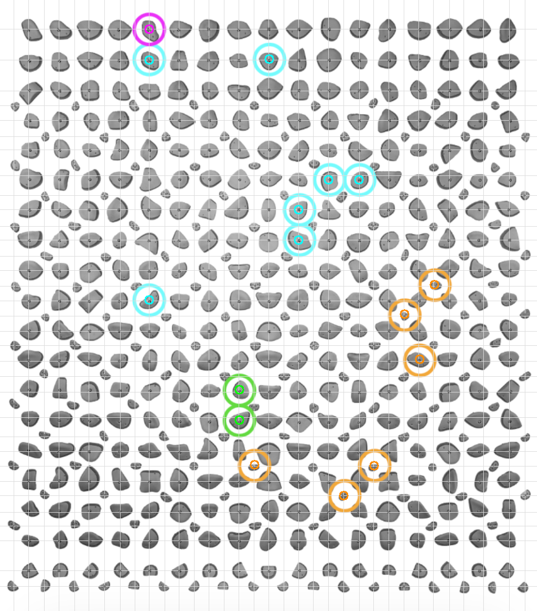
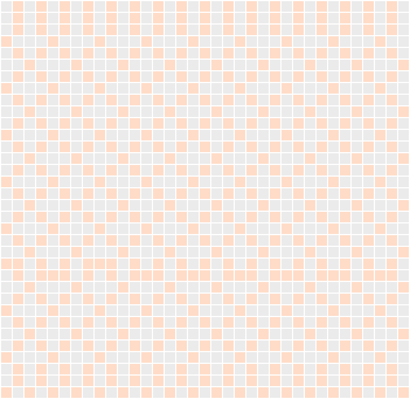
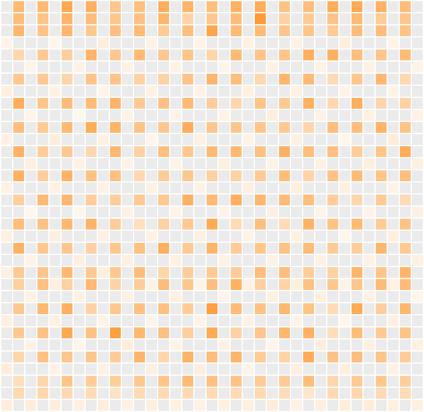
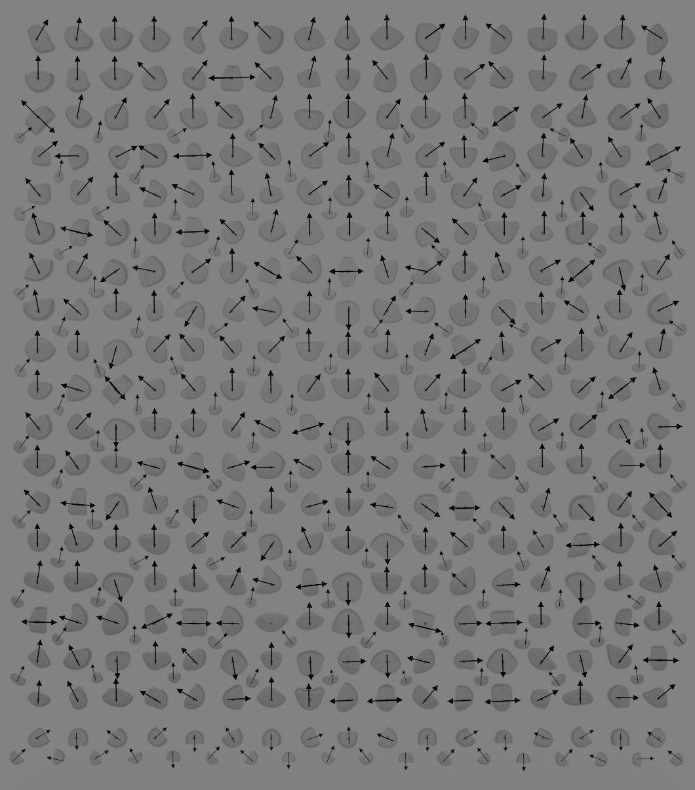
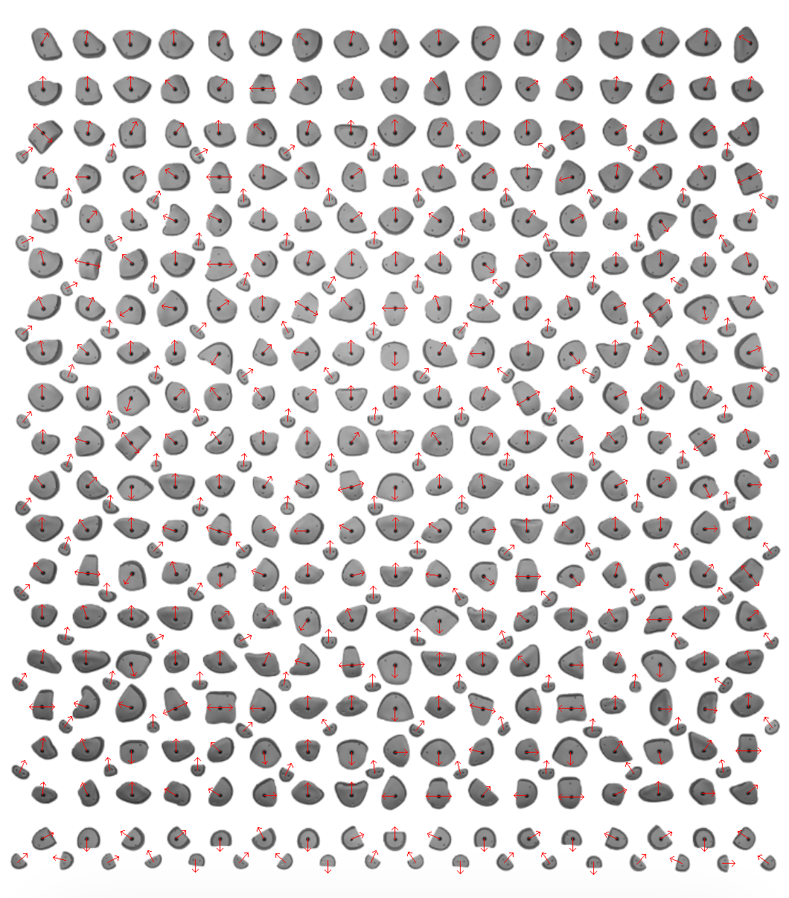

# Kilterboardie

Kilterboard dataset export and a conditional VAE for generating Kilterboard routes.

## Dataset Overview

Each route is encoded as a tensor with shape `rows x cols x channels`.

- `rows`: 34
- `cols`: 35
- `channels`: 10

### Channel Labels

Channel order (axis 2) is:

- `start` (binary)
- `finish` (binary)
- `hand` (binary)
- `foot` (binary)
- `hold_presence` (binary, 1 if a hold exists at that grid cell)
- `hold_size` (float in [0, 1], normalized hold area)
- `orient_sin1` (float, `sin(theta1)` for primary orientation)
- `orient_cos1` (float, `cos(theta1)` for primary orientation)
- `orient_sin2` (float, `sin(theta2)` for secondary orientation)
- `orient_cos2` (float, `cos(theta2)` for secondary orientation)

Orientation angles are stored per hold in `ImageData/References/holds.json` and are also encoded per grid cell as `sin/cos` channels.
The exported matrices are `34 x 35 x 10` with the channel list above.

### File Format

For each route in `ImageData/50Degree/Export`:

- `<route>.npy`: `H x W x 10` float32 matrix
- `<route>.json`: metadata with `rows`, `cols`, `channels`, `grade_v`, and ring counts

### Hold Grid + Labeled Rings (Overlay)



Legend:
- Green ring: `start`
- Magenta ring: `finish`
- Cyan ring: `hand`
- Orange ring: `foot`
- Gray dots: detected hold centers
- Light grid: row/column centers used for the matrix layout

### Hold Grid Maps

#### Hold Presence (Binary)



Legend:
- Light orange: hold present (1)
- Light gray: no hold (0)

#### Hold Size (Normalized)



Legend:
- Light gray: no hold
- Light orange: smaller holds
- Darker orange: larger holds

### Hold Orientations

Each hold can have up to two orientation angles (in radians) stored in `ImageData/References/holds.json` under `holds[*].orientations`. Angles are measured using `atan2(dy, dx)` in image coordinates, so values are in `[-pi, pi]` relative to the +x axis. These are encoded into the matrix as `orient_sin1/cos1` and `orient_sin2/cos2`.

#### Orientation Input (Annotated Board)



#### Orientation Overall Bias Check



Legend:
- Red arrows: detected hold orientation vectors (up to two per hold)

### Notes

- The grid is derived from the detected hold centers stored in `ImageData/References/holds.json`.
- `hold_size` is normalized by the maximum hold area in the board so values are in `[0, 1]`.
- The dataset currently contains only 50° climbs (grade `V3` and higher).

## Model (Conditional VAE)

The model is defined in `cvae_model.py` as `KilterCVAE`.

**Inputs**
- `route`: `(B, 4, H, W)` for the 4 dynamic channels (`start`, `finish`, `hand`, `foot`)
- `static`: `(B, 2, H, W)` for `hold_presence` and `hold_size`
- `grade`: `(B,)` int64 in `[0, num_grades-1]`

**Output**
- `logits`: `(B, 4, H, W)` for the 4 dynamic channels

Note: the current data loader (`cvae_data.py`) slices only the first 6 channels (route + static). The orientation channels are present in the dataset but are not used by the model as written.

**Loss**
- Reconstruction: BCEWithLogitsLoss over hold positions
- KL divergence (beta-scaled)
- Optional count loss to encourage realistic counts for `start` and `finish`
- Optional focal loss

## Training

Training entry point: `cvae_train.py`.

Example:

```bash
python cvae_train.py --data-dir ImageData/50Degree/Export --epochs 30 --batch-size 64
```

Key options:
- `--beta`: KL weight
- `--count-weight`: start/finish count regularizer
- `--focal-gamma`: focal loss gamma
- `--grade-min`, `--grade-max`: controlled in `KilterRouteDataset` (defaults V3–V13)

Artifacts are saved under `runs/cvae/<timestamp>/`.

## Generation

Generate routes from a trained checkpoint with `cvae_generate.py`:

```bash
python cvae_generate.py \
  --checkpoint runs/cvae/<run>/best.pt \
  --data-dir ImageData/50Degree/Export \
  --grade 6 \
  --n 4 \
  --out generated_route.npy
```

The output is a full `H x W x 6` matrix (route + static channels) plus a JSON sidecar.

## Project Layout

- `ImageData/50Degree/Export/`: exported dataset (`.npy` + `.json` per route)
- `ImageData/References/`: hold grid, overlays, orientation assets, `holds.json`
- `dataset.py`: utilities for building hold maps, overlays, and exporting matrices
- `cvae_data.py`: dataset loader for training
- `cvae_model.py`: CVAE model + loss
- `cvae_train.py`: training loop
- `cvae_generate.py`: sampling/generation
