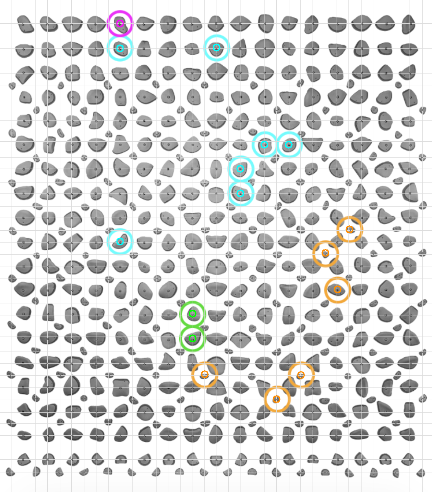
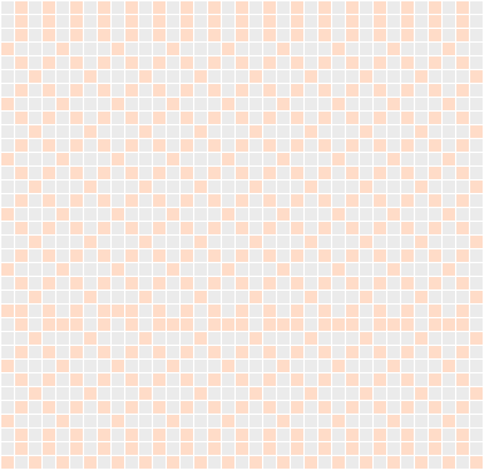
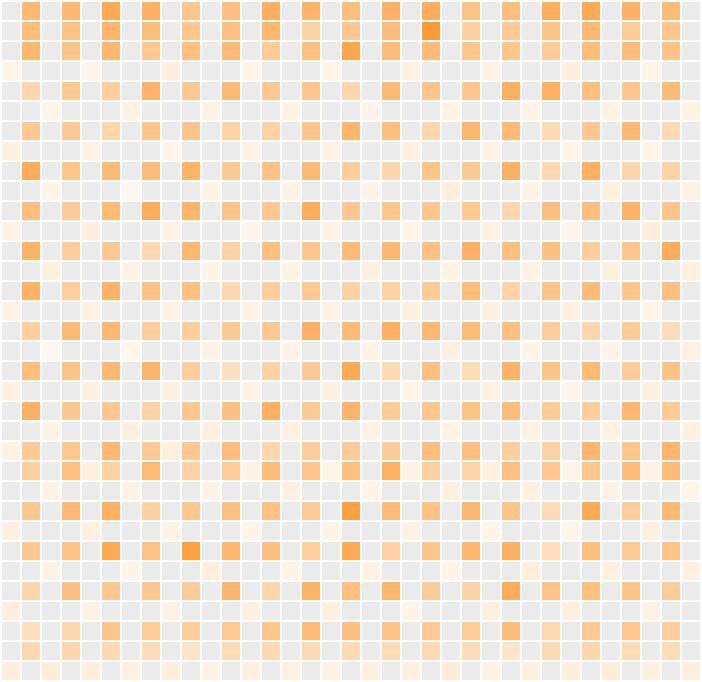
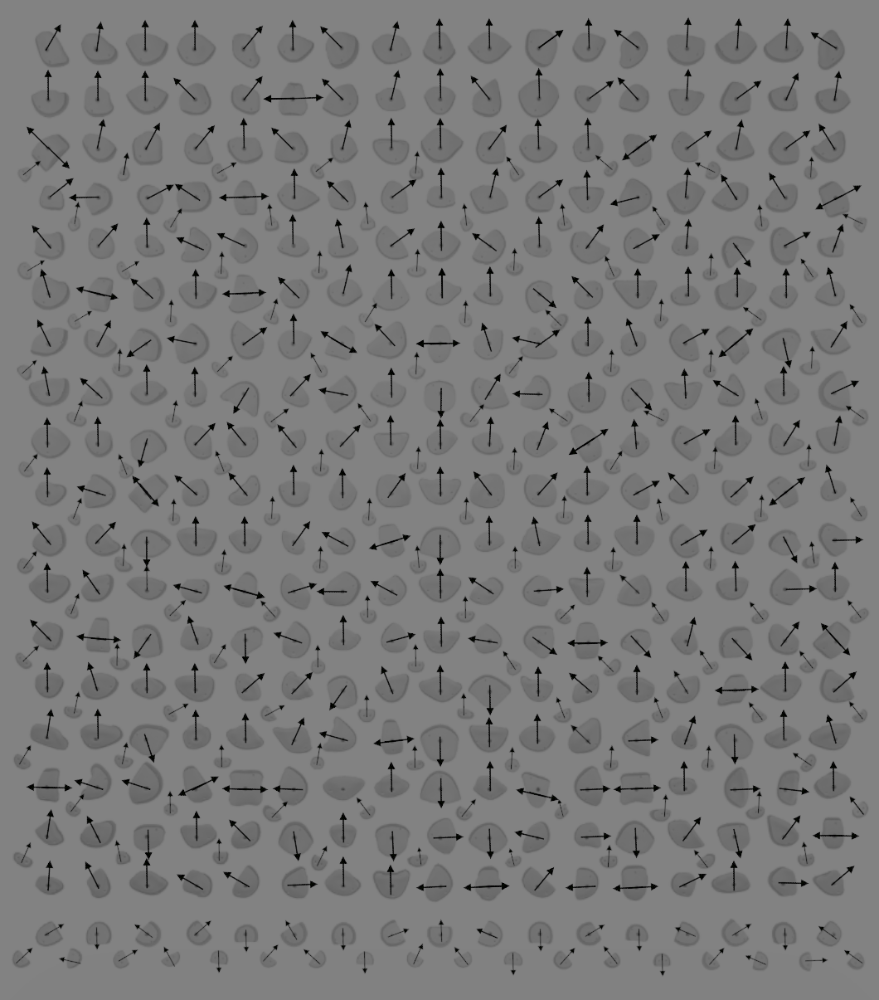
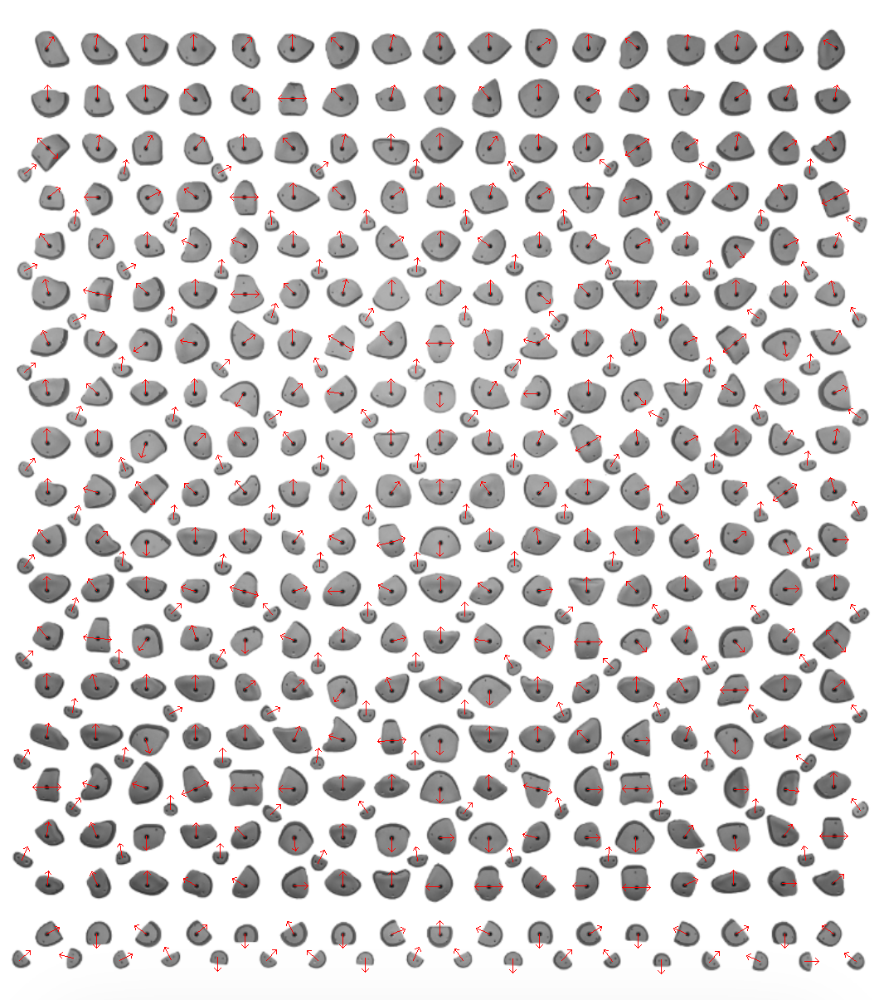

# Kilterboardie

Kilterboard dataset export and two conditional generative models for new route synthesis: a CVAE and a diffusion model.

## Dataset Overview

Each route is encoded as a tensor with shape `rows x cols x channels`.

- `rows`: 34
- `cols`: 35
- `channels`: 10

### Channel Labels

Channel order (axis 2) is:

- `start` (binary)
- `finish` (binary)
- `hand` (binary)
- `foot` (binary)
- `hold_presence` (binary, 1 if a hold exists at that grid cell)
- `hold_size` (float in [0, 1], normalized hold area)
- `orient_sin1` (float, `sin(theta1)` for primary orientation)
- `orient_cos1` (float, `cos(theta1)` for primary orientation)
- `orient_sin2` (float, `sin(theta2)` for secondary orientation)
- `orient_cos2` (float, `cos(theta2)` for secondary orientation)

Orientation angles are stored per hold in `ImageData/References/holds.json` and are also encoded per grid cell as `sin/cos` channels.
The exported matrices are `34 x 35 x 10` with the channel list above.

### File Format

For each route in `ImageData/50Degree/Export`:

- `<route>.npy`: `H x W x 10` float32 matrix
- `<route>.json`: metadata with `rows`, `cols`, `channels`, `grade_v`, and ring counts

### Hold Grid + Labeled Rings (Overlay)



Legend:
- Green ring: `start`
- Magenta ring: `finish`
- Cyan ring: `hand`
- Orange ring: `foot`
- Gray dots: detected hold centers
- Light grid: row/column centers used for the matrix layout

### Hold Grid Maps

#### Hold Presence (Binary)



Legend:
- Light orange: hold present (1)
- Light gray: no hold (0)

#### Hold Size (Normalized)



Legend:
- Light gray: no hold
- Light orange: smaller holds
- Darker orange: larger holds

### Hold Orientations

Each hold can have up to two orientation angles (in radians) stored in `ImageData/References/holds.json` under `holds[*].orientations`. Angles are measured using `atan2(dy, dx)` in image coordinates, so values are in `[-pi, pi]` relative to the +x axis. These are encoded into the matrix as `orient_sin1/cos1` and `orient_sin2/cos2`.

#### Orientation Input (Annotated Board)



#### Orientation Overall Bias Check



Legend:
- Red arrows: detected hold orientation vectors (up to two per hold)

### Notes

- The grid is derived from the detected hold centers stored in `ImageData/References/holds.json`.
- `hold_size` is normalized by the maximum hold area in the board so values are in `[0, 1]`.
- The dataset currently contains only 50° climbs (grade `V3` and higher).

## Channel Split Used By Models

The exported tensor has 10 channels, but both model families split it into:

- `route`: 4 dynamic channels (`start`, `finish`, `hand`, `foot`)
- `static`: 6 conditioning channels (`hold_presence`, `hold_size`, `orient_sin1`, `orient_cos1`, `orient_sin2`, `orient_cos2`)

## Model (Conditional VAE)

The model is defined in `cvae_model.py` as `KilterCVAE`.

**Inputs**
- `route`: `(B, 4, H, W)` for the 4 dynamic channels (`start`, `finish`, `hand`, `foot`)
- `static`: `(B, 6, H, W)` for hold presence, hold size, and both orientation sin/cos pairs
- `grade`: `(B,)` int64 in `[0, num_grades-1]`

**Output**
- `logits`: `(B, 4, H, W)` for the 4 dynamic channels

**Loss**
- Reconstruction: BCEWithLogitsLoss over hold positions
- KL divergence (beta-scaled)
- Optional count loss to encourage realistic counts for `start` and `finish`
- Optional focal loss
- Optional path loss to encourage reachable sequences from start to finish
- Optional upward loss to discourage implausible hand placements below starts or above finishes

## Training

Training entry point: `cvae_train.py`.

Example:

```bash
python cvae_train.py --data-dir ImageData/50Degree/Export --epochs 30 --batch-size 64
```

Key options:
- `--beta`: KL weight
- `--count-weight`: start/finish count regularizer
- `--focal-gamma`: focal loss gamma
- `--path-weight`, `--path-reach`, `--path-steps`: path connectivity regularization
- `--upward-weight`: vertical hand-placement regularization

Artifacts are saved under `runs/cvae/<timestamp>/`.

## Generation

Generate routes from a trained checkpoint with `cvae_generate.py`:

```bash
python cvae_generate.py \
  --checkpoint runs/cvae/<run>/best.pt \
  --data-dir ImageData/50Degree/Export \
  --grade 6 \
  --n 4 \
  --out generated_route.npy
```

The output is a full `H x W x (4 + static_channels)` matrix (route + static channels) plus a JSON sidecar.

## Diffusion Model (Conditional DDPM)

Alternative generator implemented in:
- `diffusion_model.py`
- `diffusion_train.py`
- `diffusion_generate.py`

The diffusion model is implemented as a grade-conditioned U-Net denoiser with a Gaussian DDPM scheduler.

This model denoises the 4 dynamic route channels (`start`, `finish`, `hand`, `foot`) conditioned on:
- static channels (`hold_presence`, `hold_size`, `orient_sin1`, `orient_cos1`, `orient_sin2`, `orient_cos2`)
- grade embedding
- timestep embedding

Training losses:
- masked denoising MSE over valid hold cells
- masked reconstruction BCE on reconstructed route probabilities
- count loss for realistic start/finish counts
- path loss for start-to-finish reachability
- upward loss for vertical plausibility
- hand-density and foot-density losses to control occupancy

Train:

```bash
python diffusion_train.py \
  --data-dir ImageData/50Degree/Export \
  --epochs 40 \
  --batch-size 64
```

Useful options:

- `--timesteps`, `--beta-start`, `--beta-end`: diffusion schedule
- `--base-channels`, `--grade-emb-dim`, `--time-emb-dim`: model capacity
- `--eps-weight`, `--recon-weight`: denoising vs reconstruction balance
- `--count-weight`, `--path-weight`, `--upward-weight`: structure regularizers
- `--hand-density-weight`, `--foot-density-weight`: occupancy regularizers

Run visualization:

```bash
python diffusion_visualize.py \
  --run-dir runs/diffusion/<run> \
  --data-dir ImageData/50Degree/Export
```

Generate:

```bash
python diffusion_generate.py \
  --checkpoint runs/diffusion/<run>/best.pt \
  --data-dir ImageData/50Degree/Export \
  --grade 6 \
  --n 4 \
  --out generated_route.npy
```

The output format matches the CVAE generator: full `H x W x (4 + static_channels)` tensor(s) and a JSON sidecar. Sampling is then decoded with empirical per-grade count priors for start, finish, hand, and foot placements.

## Project Layout

- `ImageData/50Degree/Export/`: exported dataset (`.npy` + `.json` per route)
- `ImageData/References/`: hold grid, overlays, orientation assets, `holds.json`
- `dataset.py`: utilities for building hold maps, overlays, and exporting matrices
- `cvae_data.py`: dataset loader for training
- `cvae_model.py`: CVAE model + loss
- `cvae_train.py`: training loop
- `cvae_generate.py`: sampling/generation
- `cvae_predict.py`: lightweight CVAE inference bundle loader
- `diffusion_model.py`: diffusion denoiser + scheduler + losses
- `diffusion_train.py`: diffusion training loop
- `diffusion_generate.py`: diffusion sampling/generation
- `diffusion_visualize.py`: training-curve and sample-grid rendering

## Web App + Fly.io Deployment

The website uses the FastAPI server in `server.py` for generation.
In the current UI configuration, diffusion is the default and first model choice.

### Runtime Assets

The deployed server no longer needs the full exported training dataset at runtime.
Instead it serves from a slim inference bundle:

- `models/best.pt`: CVAE checkpoint
- `models/diffusion_best.pt`: deployed diffusion checkpoint
- `inference_bundle/static.npy`: full `34 x 35 x 6` static conditioning tensor
- `inference_bundle/count_histograms.json`: per-grade route-count priors used during decoding
- `ImageData/References/holds.json`: hold coordinates and orientations for board rendering
- `ImageData/References/empty_board.png`: reference board image for overlays

This keeps Fly.io deploys much smaller while preserving the same generation logic.

### Fly.io

Deployment config lives in `fly.toml` and the container image is built from `Dockerfile`.

Useful commands:

```bash
./.fly/bin/flyctl status
./.fly/bin/flyctl deploy
```

The Docker context is reduced with `.dockerignore` so Fly only uploads the API code, inference assets, reference board assets, and the selected checkpoints.

## Grade Distribution Statistics

Source: `ImageData/grade_distribution_45_50.csv`

Format: `V grade/French grade` (example: `V3/6a`).

Total routes: **45° = 32813**, **50° = 30000**

| Grade | 45° Count | 45° Percent | 50° Count | 50° Percent |
|---|---:|---:|---:|---:|
| V3/6a | 4655 | 14.19% | 3210 | 10.7% |
| V4/6b | 4654 | 14.18% | 3570 | 11.9% |
| V5/6c | 5314 | 16.19% | 3870 | 12.9% |
| V6/7a | 4883 | 14.88% | 3840 | 12.8% |
| V7/7a+ | 3676 | 11.2% | 2970 | 9.9% |
| V8/7b | 4396 | 13.4% | 4890 | 16.3% |
| V9/7c | 2403 | 7.32% | 3000 | 10.0% |
| V10/7c+ | 1547 | 4.71% | 2160 | 7.2% |
| V11/8a | 627 | 1.91% | 1470 | 4.9% |
| V12/8a+ | 99 | 0.3% | 690 | 2.3% |
| V13/8b | 0 | 0% | 90 | 0.3% |
| Unknown | 559 | 1.7% | 240 | 0.8% |
